= Design Patterns CheatSheet
:toc:

Personnal cheatsheet for design patterns, made with PlantUML.

== Structural patterns

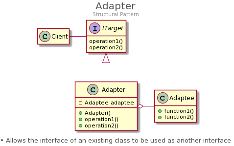

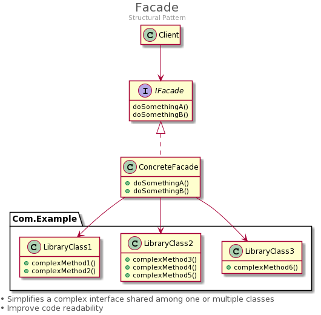

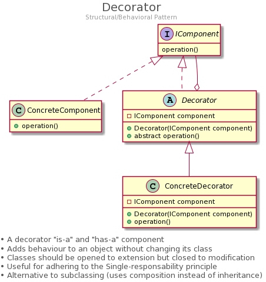

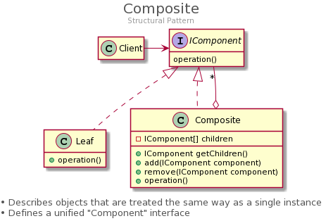

== Creational patterns

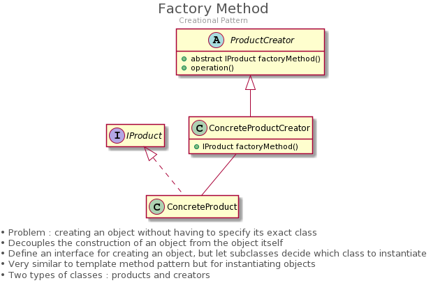

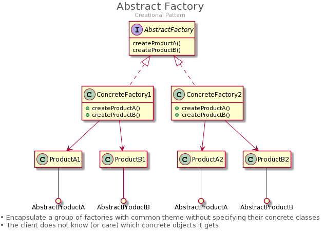

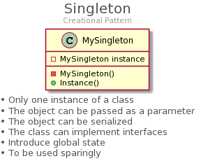

== Behavioral patterns

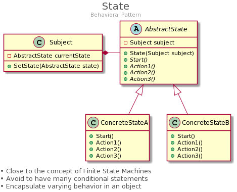

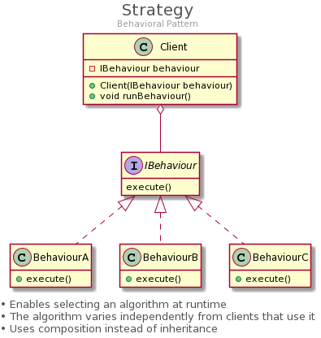

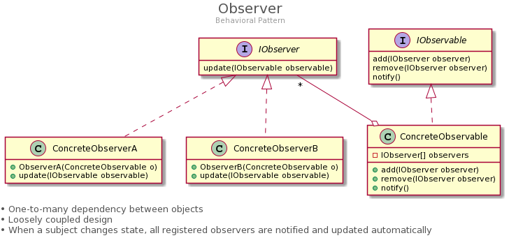

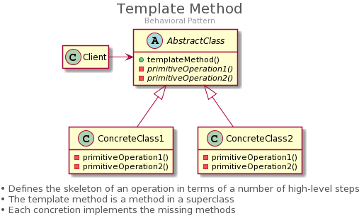

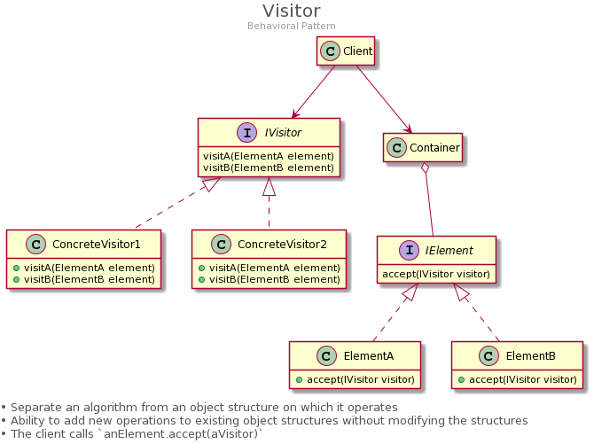

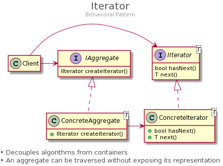

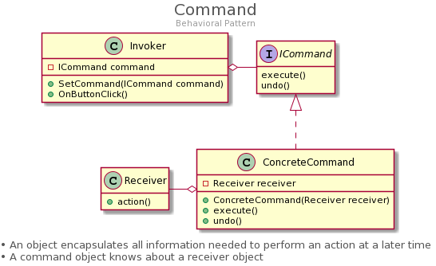

== Other resources

Some other resources about design patterns:

* link:https://www.youtube.com/playlist?list=PLrhzvIcii6GNjpARdnO4ueTUAVR9eMBpc[Design Patterns in Object Oriented Programming by Christopher Okhravi's (YouTube Playlist)]
* link:https://www.oreilly.com/library/view/head-first-design/0596007124/[Head First Design Patterns (Book, Oreilly)]
* link:https://www.youtube.com/watch?v=TeZqKnC2gvA[Understanding The Visitor Design Pattern by The Simple Engineer (YouTube)]
* link:https://gameprogrammingpatterns.com/contents.html[Game Programming Patterns (Free web-based book)]

